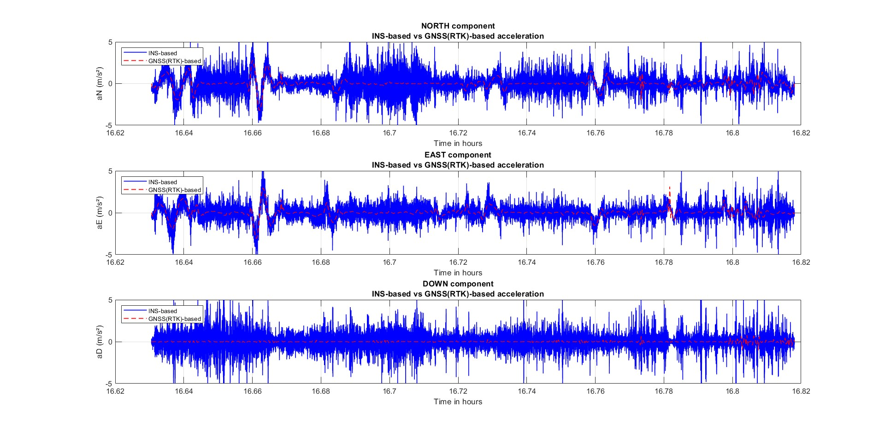
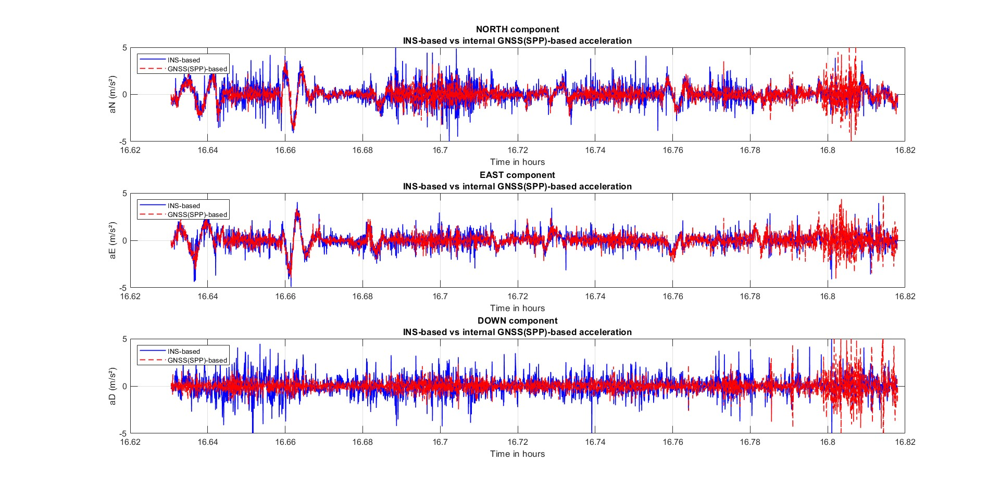
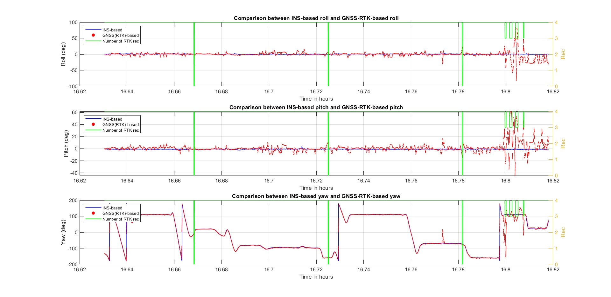
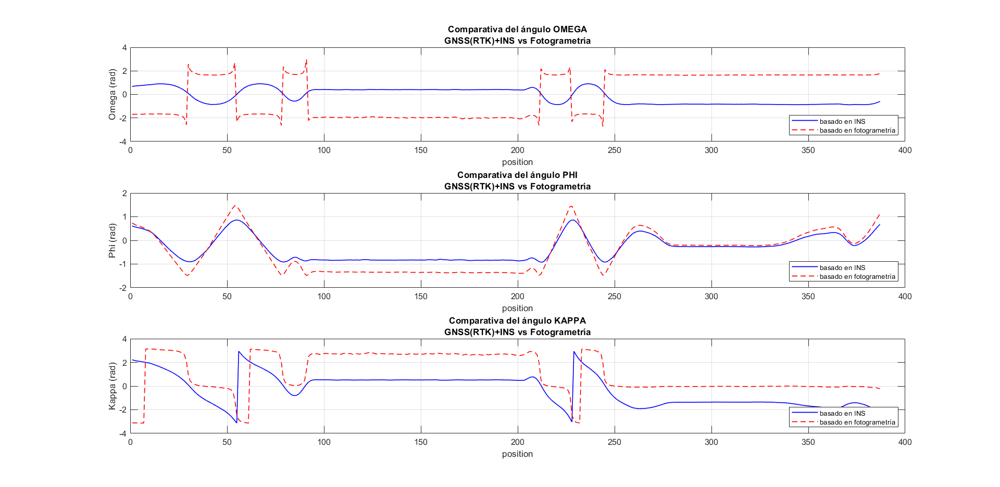
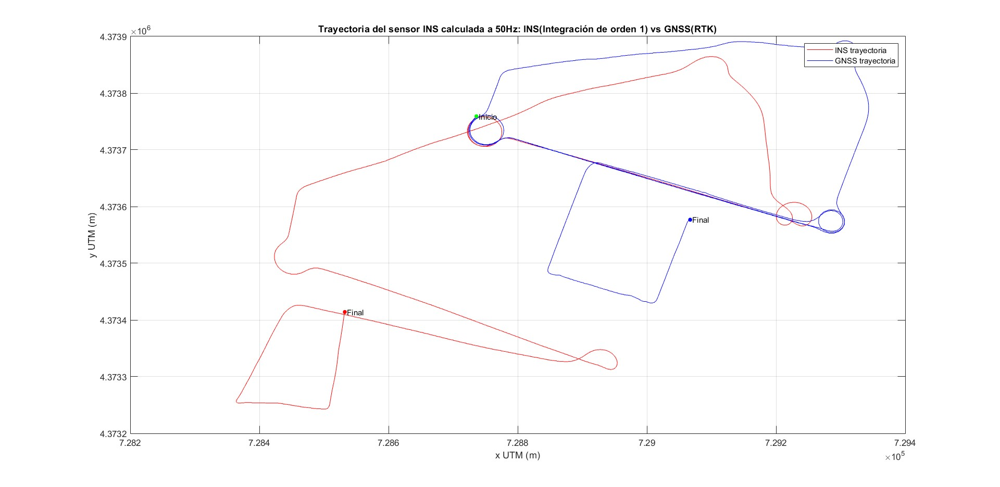
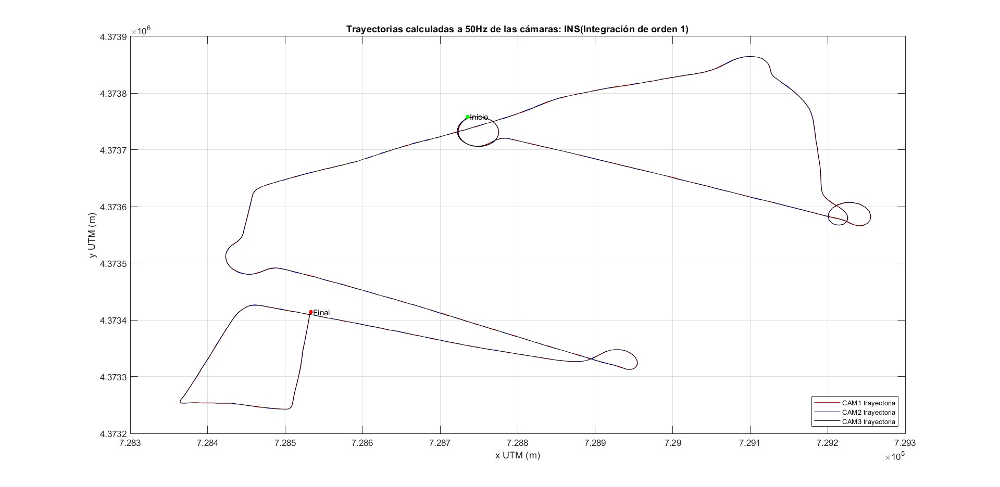
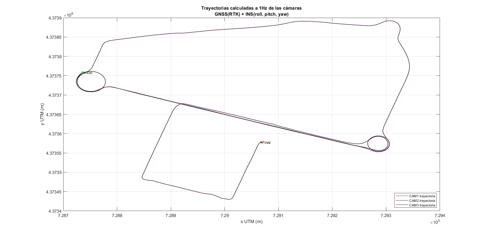
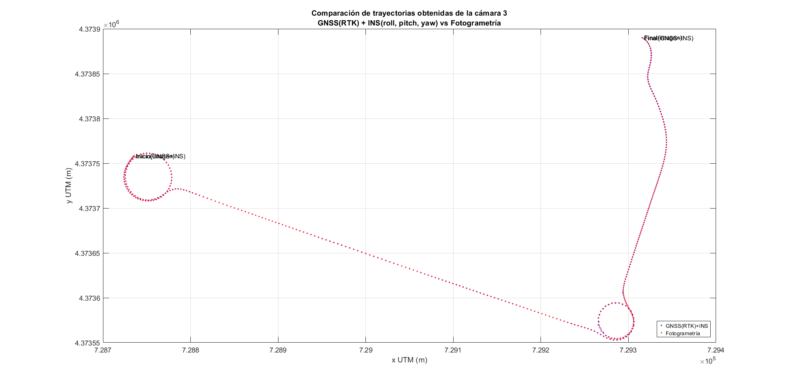
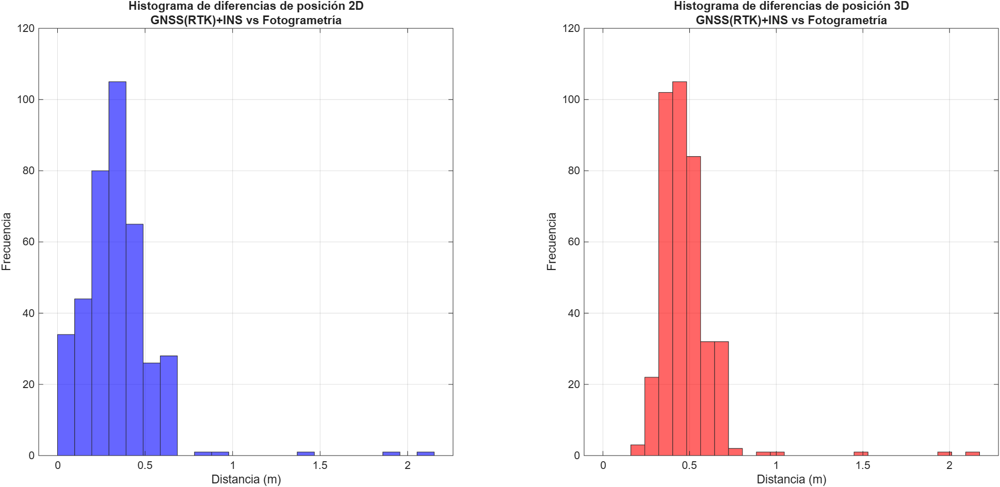

## Acceleration comparison

| GNSS(RTK) vs. INS | GNSS(SPP) vs. INS |
|:---:|:---:|
|  |  |

---

## Omega–Phi–Kappa (OPK) angle comparison

| GNSS(RTK) vs. INS | GNSS(RTK) + INS vs. Photogrammetry |
|:---:|:---:|
|  |  |

---

## Trajectory comparison

| INS sensor trajectory: RTK vs. INS | Camera trajectory from 1st-Order INS integration | Camera trajectory from INS/GNSS integration |
|:---:|:---:|:---:|
|  |  |  |

---
|  Camera 3 trajectory: INS/GNSS vs. Photogrammetry | Camera 3 position difference histogram (INS/GNSS vs. Photogrammetry) |
|:---:|:---:|
|  |  |

---
