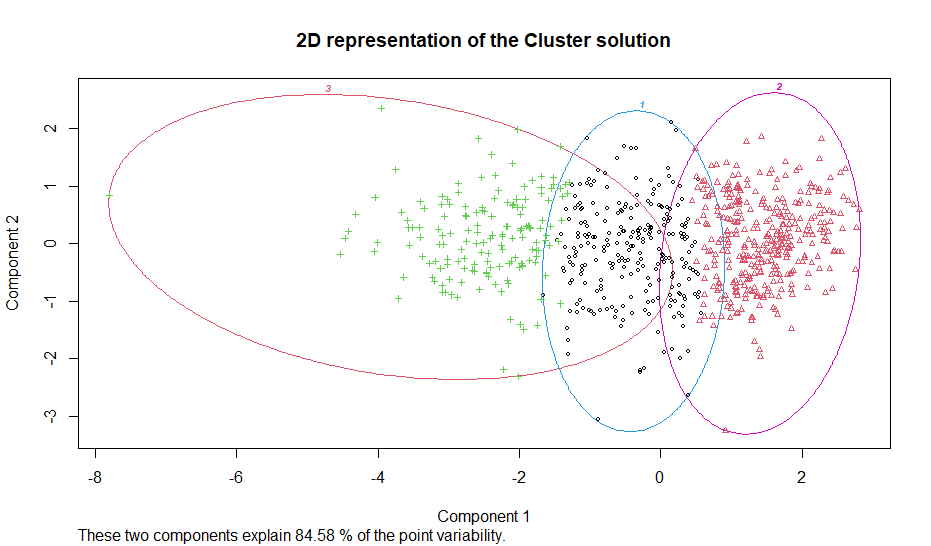
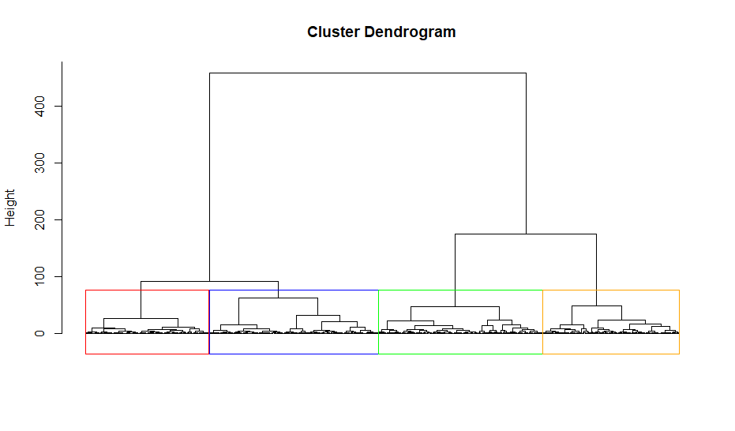

## Geostatistical interpolation

| Kriging prediction | Co-kriging prediction |
|:---:|:---:|
|  |  |
|  |  |

---
## Spatial autocorrelation

| Spatial distribution | Local Moran's I |
|:---:|:---:|
|  |  |

| LISA cluster map | Hot spot analysis |
|:---:|:---:|
|  |  |

---

## Clustering

| K-Means | Hierarchical Clustering |
|:---:|:---:|
|  |  |
|  |  |

---

