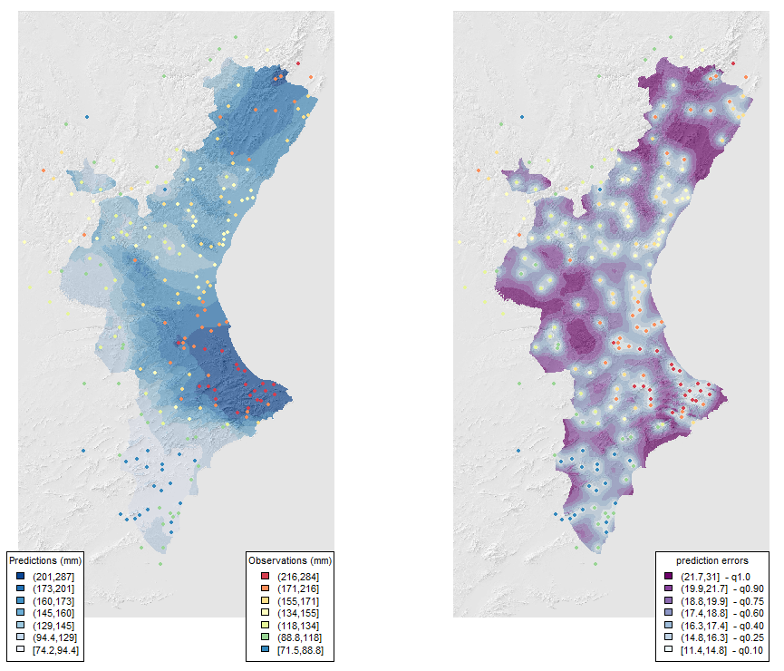
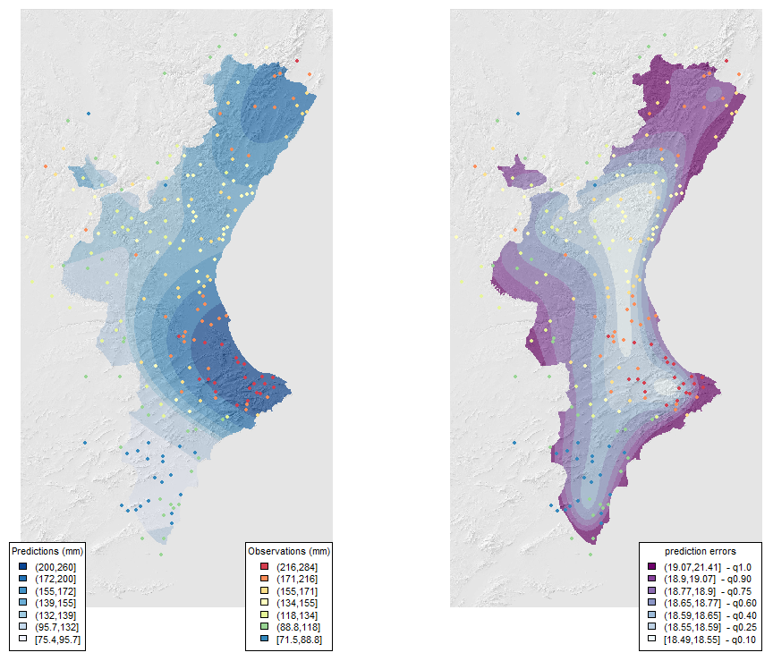
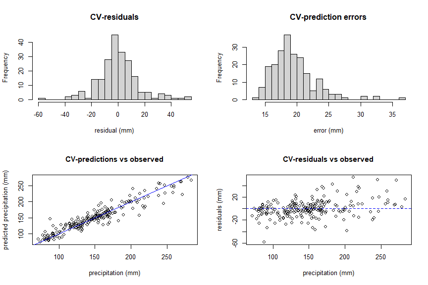
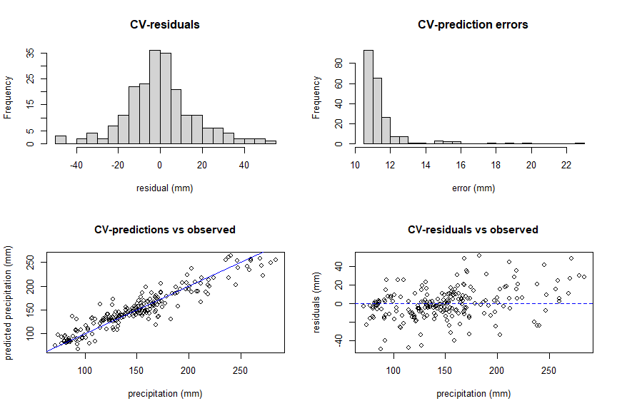
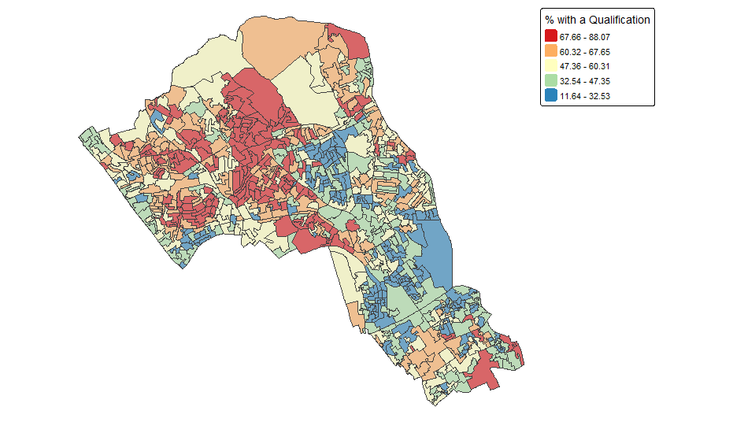
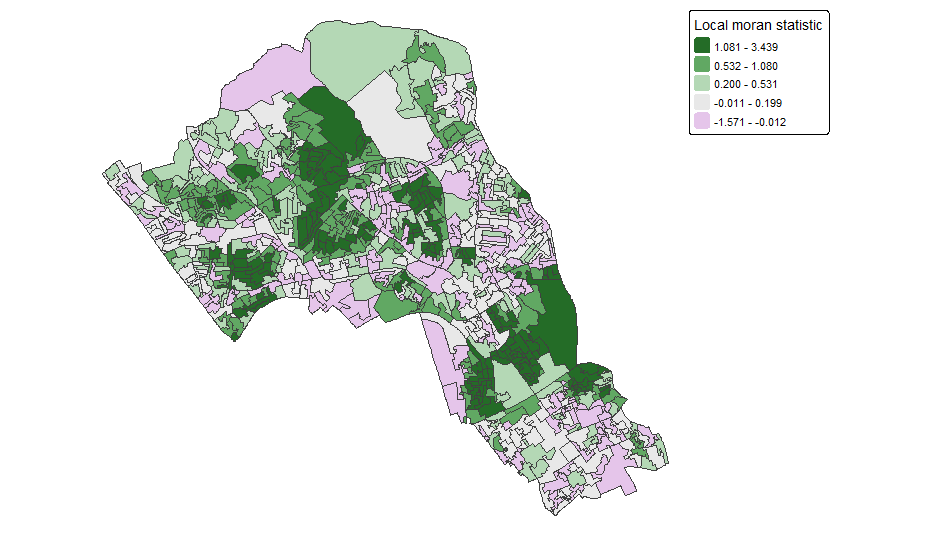
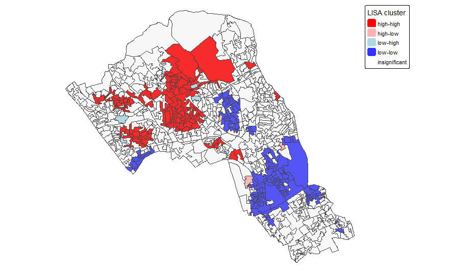
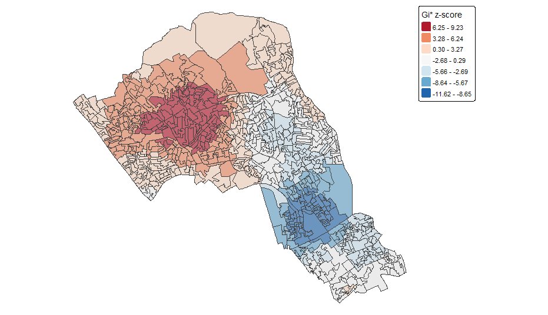
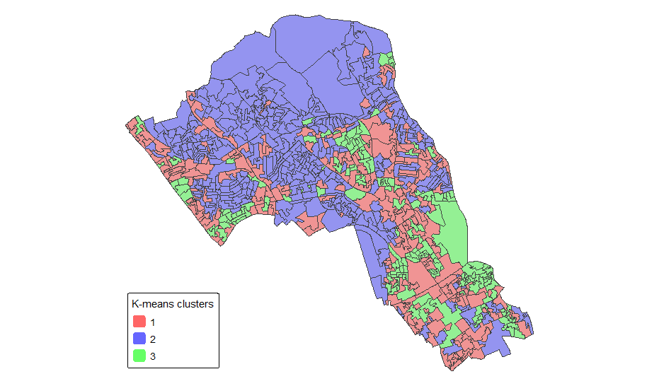
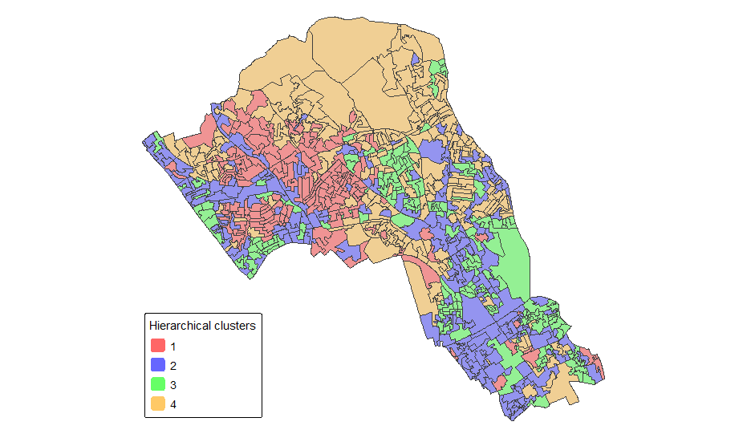

## Geostatistical interpolation

| Kriging prediction | Co-kriging prediction |
|---|---| 
|  |  |
|  |  |

---

## Spatial autocorrelation

| Spatial distribution | Local Moran's I |
|---|---| 
|  |  | 
| | |
| LISA | Hot spot|
|  |  |

---

## Clustering

| K-Means | Hierarchical Clustering| 
|---|---| 
|  |  |

---